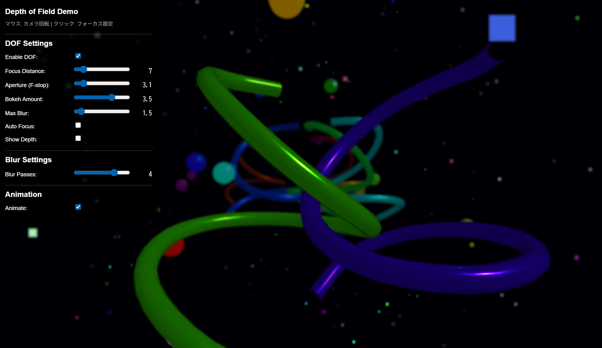

# Kawase Blur DOF (Depth of Field)

A real-time depth of field implementation using Kawase blur algorithm with Three.js. This project demonstrates physically-based depth of field effects with interactive controls for focus distance, aperture, and bokeh amount.



## Features

- **Kawase Blur Algorithm**: Efficient 4-tap sampling pattern for high-quality blur with minimal performance impact
- **Physically-Based DOF**: Circle of Confusion (CoC) calculation based on camera parameters
- **Real-time Interaction**: 
  - Mouse movement for camera control
  - Click to set focus point
  - Auto-focus mode
- **Comprehensive Controls**:
  - Focus distance adjustment
  - Aperture (F-stop) control
  - Bokeh amount and maximum blur settings
  - Depth visualization mode
- **Multi-pass Rendering**: Efficient depth-based blur with ping-pong buffering
- **No External Dependencies**: Works directly in the browser without server setup

## Demo

Open `kawase_blur.html` in a modern web browser to see the demo in action.

**Controls:**
- **Mouse Movement**: Rotate camera
- **Click**: Set focus point on clicked object
- **UI Panel**: Adjust all DOF parameters in real-time

## Technical Implementation

### Kawase Blur Algorithm

The implementation uses the Kawase blur technique, which samples 4 diagonal points around each pixel:

```glsl
// 4-tap Kawase blur pattern
color += texture2D(tDiffuse, vUv + vec2(-uvOffset.x, -uvOffset.y));
color += texture2D(tDiffuse, vUv + vec2(uvOffset.x, -uvOffset.y));
color += texture2D(tDiffuse, vUv + vec2(-uvOffset.x, uvOffset.y));
color += texture2D(tDiffuse, vUv + vec2(uvOffset.x, uvOffset.y));
```

### Rendering Pipeline

1. **Depth Pass**: Render scene depth information
2. **Scene Pass**: Render scene with normal materials
3. **CoC Calculation**: Compute Circle of Confusion based on depth and camera parameters
4. **Multi-pass Blur**: Apply Kawase blur with depth-adaptive sampling
5. **Final Composition**: Blend original and blurred images based on CoC values

### Circle of Confusion (CoC) Calculation

The CoC is calculated using simplified camera optics:

```glsl
float getCoC(float depth) {
    float realDepth = near + depth * (far - near);
    float diff = abs(realDepth - focusDistance);
    float coc = diff / (focusDistance + 10.0);
    coc *= (4.0 / aperture); // F-stop influence
    coc = pow(coc, 1.2); // Natural curve
    return clamp(coc, 0.0, 0.8);
}
```

## Parameters

### DOF Settings

| Parameter | Range | Default | Description |
|-----------|-------|---------|-------------|
| **Focus Distance** | 1-50 | 15 | Distance of the focal plane from camera |
| **Aperture (F-stop)** | 0.5-22 | 2.8 | Camera aperture - smaller values = stronger bokeh |
| **Bokeh Amount** | 0-5 | 2 | Overall bokeh intensity multiplier |
| **Max Blur** | 0-20 | 10 | Maximum blur radius in pixels |
| **Auto Focus** | On/Off | Off | Automatically focus on center object |
| **Show Depth** | On/Off | Off | Visualize depth and CoC maps |

### Blur Settings

| Parameter | Range | Default | Description |
|-----------|-------|---------|-------------|
| **Blur Passes** | 1-5 | 3 | Number of blur iterations (more = smoother) |

## Browser Compatibility

- **Chrome/Edge**: Full support
- **Firefox**: Full support
- **Safari**: Full support (iOS 12+)

Requires WebGL support and ES6 modules.

## Performance Notes

- **Kawase Blur Advantage**: ~4x faster than traditional Gaussian blur
- **Multi-pass Efficiency**: Each pass uses only 4 texture samples
- **Adaptive Quality**: Blur intensity adapts to depth differences
- **Memory Efficient**: Ping-pong rendering avoids feedback loops

## Files Structure

```
├── kawase_blur.html          # Main demo file
├── README.md                 # This documentation
├── LICENSE                   # MIT License
└── screenshot.png           # Demo screenshot (optional)
```

## Getting Started

1. **Clone the repository**:
   ```bash
   git clone https://github.com/yourusername/kawase-blur-dof.git
   cd kawase-blur-dof
   ```

2. **Open in browser**:
   Simply open `kawase_blur.html` in any modern web browser. No build process required!

3. **Experiment with parameters**:
   - Try different aperture values (F1.4 vs F16)
   - Click on objects at different distances
   - Enable "Show Depth" to visualize the effect

## Technical Details

### Shader Implementation

The project implements several custom shaders:

1. **Depth Shader**: Extracts linear depth information
2. **CoC Shader**: Computes Circle of Confusion based on camera parameters
3. **Kawase Blur Shader**: Multi-pass blur with depth-adaptive sampling
4. **DOF Composition Shader**: Final blend between sharp and blurred images

### Performance Optimizations

- **Efficient Sampling**: 4-tap pattern instead of 9+ taps in traditional methods
- **Depth-Adaptive Blur**: Only applies strong blur where needed
- **Render Target Reuse**: Ping-pong buffering prevents memory waste
- **Early Termination**: Skip blur passes when CoC is minimal

## Real-world Applications

This technique is widely used in:

- **Game Engines**: Unity, Unreal Engine post-processing pipelines
- **Real-time Rendering**: VR/AR applications requiring 90+ FPS
- **Mobile Graphics**: Efficient blur for resource-constrained devices
- **Film/VFX**: Preview rendering for depth of field effects

## References

- **Kawase, Masaki**: "Frame Buffer Postprocessing Effects in DOUBLE-S.T.E.A.L (Wreckless)" - [GDC 2003 Presentation](https://www.gdcvault.com/play/1022665/Frame-Buffer-Postprocessing-Effects-in)
- **GPU Gems**: Advanced depth of field techniques
- **Real-Time Rendering 4th Edition**: Camera and lens simulation

## Contributing

Contributions are welcome! Areas for improvement:

- Bokeh shape customization (hexagonal, octagonal)
- Chromatic aberration effects
- Performance profiling tools
- Mobile optimization
- Additional demo scenes

## License

This project is licensed under the MIT License - see the [LICENSE](LICENSE) file for details.

## Acknowledgments

- Three.js community for the excellent WebGL framework
- Masaki Kawase for the original blur algorithm
- GPU Gems series for depth of field techniques
- WebGL community for shader optimization insights

---

**Enjoy experimenting with depth of field effects!** 📸✨